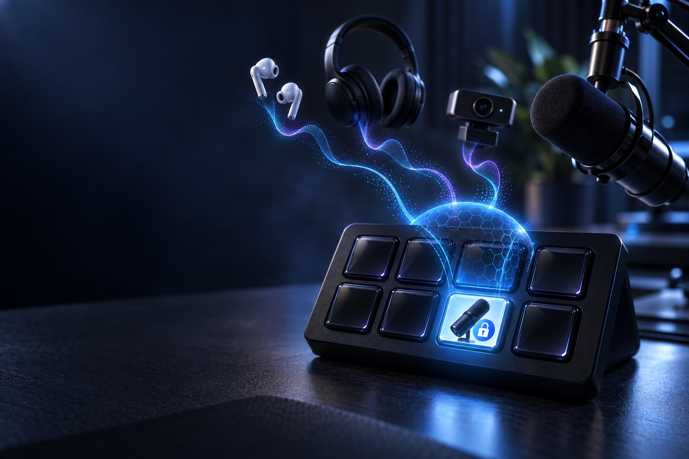
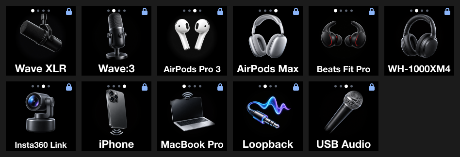

# Mic Lock



A Stream Deck key for picking your Mac's microphone, and a lock that keeps it picked.

Every time I put my AirPods in, macOS switched my mic from my XLR mic to the AirPods. My old toggle key only knew about two devices, so it kept showing the wrong one. Mic Lock fixes both. One key cycles through every mic you have connected, it always shows the one actually in use, and when headphones connect and grab the mic, it switches straight back.

It runs on macOS only.



## Install

You need:

- A Mac running macOS 13 or later
- The [Stream Deck app](https://www.elgato.com/downloads), version 7.1 or later
- Apple's command line tools. If you've never installed them, run `xcode-select --install` and follow the prompt.

Then in Terminal:

```sh
git clone https://github.com/PDiTO/streamdeck-mic-lock.git
cd streamdeck-mic-lock
./install.sh
```

The script builds the small audio helper on your Mac, copies the plugin into Stream Deck and restarts the Stream Deck app. Building it yourself means macOS won't block an unsigned download.

In Stream Deck, find **Mic Lock** in the actions list on the right and drag it onto a key. That's it. The lock turns on as soon as the key exists.

To update later, run `git pull` and then `./install.sh` again. To remove it, run `./install.sh --uninstall`.

## Using it

Tap the key to move to the next mic. The key shows the mic's icon and name, and the dots along the top show where you are in the cycle.

Hold the key for about a second to jump back to your home mic. Your home mic starts as whatever was in use when you added the key.

Leave it alone otherwise. When AirPods, Beats or any other headset connects and macOS makes it the input, Mic Lock switches back to your mic within a moment. The blue padlock in the corner means the lock is on.

You can still change the mic from the menu bar or System Settings. Mic Lock treats that as your choice, keeps it and updates the key.

## Settings

Click the key in the Stream Deck app to open its settings.

- **Lock my mic** turns the lock on or off. With it off, the key still cycles and still shows the current mic.
- **Strict** means only the key can change the mic. Changes from the menu bar or System Settings get undone too.

Below that is every mic your Mac has seen, connected or not. For each one you can:

- Make it the **home mic**, where Hold takes you and where Mic Lock falls back if your chosen mic disconnects.
- Take it out of the cycle. I skip my webcam's mic and my iPhone's.
- Pick a different icon if the automatic one is wrong.
- Give it a short label. My XLR interface reports itself as "Elgato Wave XLR Dock MK.2", so I label it "SM7B" after the mic plugged into it.
- Forget it, once it's disconnected.

## How it tells your changes from macOS's

macOS switches the input right after a headset connects. So if the input changes to a device that appeared in the last 6 seconds, Mic Lock assumes macOS did it and switches back. Any other change counts as yours.

If something keeps switching the mic over and over, Mic Lock stops after 5 tries in 15 seconds instead of fighting it forever.

## Things to know

- Zoom, Discord, OBS and some other apps let you choose a mic inside the app. Mic Lock controls the Mac's default mic, so those apps use their own setting unless it's set to follow the system.
- The lock only runs while the Stream Deck app is open.
- Icons are guessed from the device name and connection type. If you've renamed your AirPods to something without "AirPods" in it, you'll get the headphones icon. Change it in settings.
- A side effect I like is that keeping your real mic selected stops AirPods from dropping into low-quality call audio, so music still sounds right.

## Troubleshooting

**The key says "No helper".** The audio helper didn't build or can't run. Run `./install.sh` again and check the output for errors.

**Mic Lock isn't in the actions list.** Quit Stream Deck from its menu bar icon and open it again.

**macOS still switched to my headphones.** A slow Bluetooth connection can switch more than 6 seconds after the headset appears, which looks like a choice you made. Turn on Strict.

## Development

The plugin is plain JavaScript with no runtime dependencies. `helper/main.swift` is a small CoreAudio bridge (`miclock list`, `miclock set <uid>`, `miclock watch`). The plugin runs it in watch mode, and all the lock logic lives in `com.pdito.mic-lock.sdPlugin/lib/lock.mjs`. It never records audio, so it doesn't ask for microphone permission.

```sh
npm ci
npm run build          # helper plus images from design/icons
npm test
npm run validate
npm run install:local  # symlink this checkout into Stream Deck instead of copying
```

The device artwork in `design/icons` was generated for this project. AirPods, Beats and the other product names are trademarks of their owners. This project isn't affiliated with Apple, Elgato or anyone else.

## License

MIT
